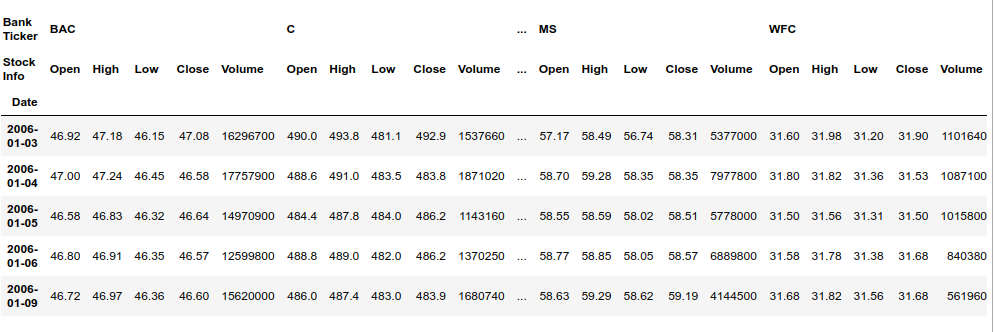
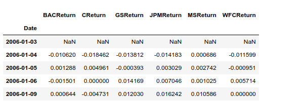
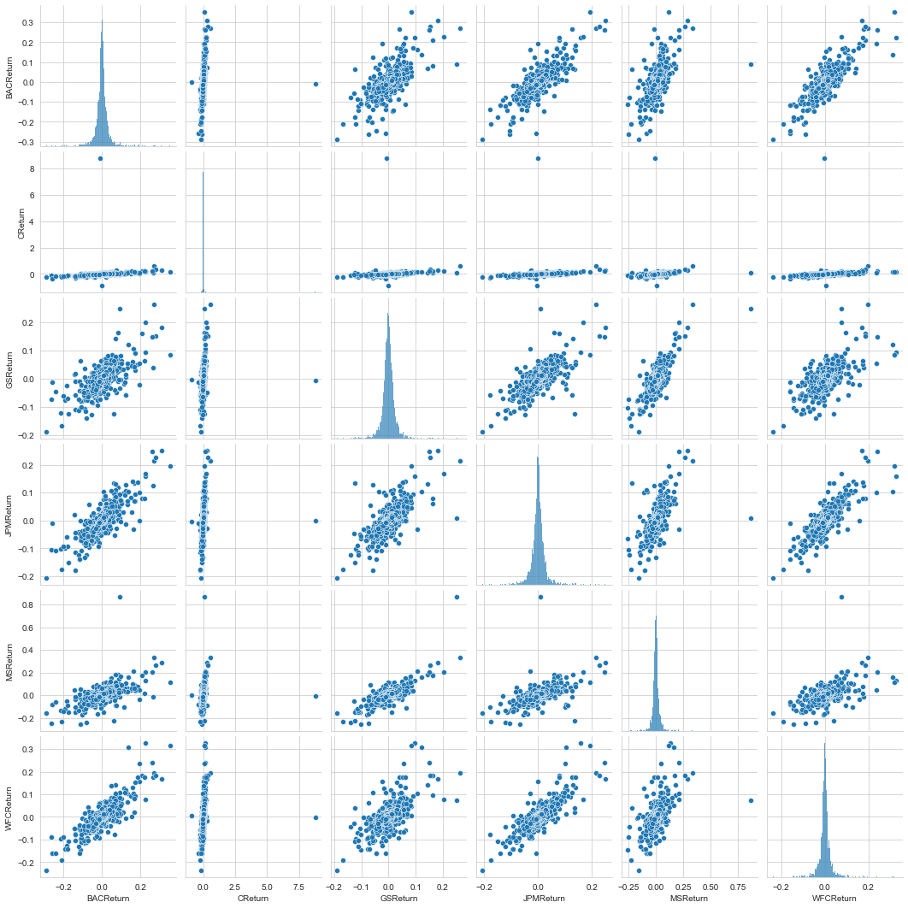

# Finance_Project
Data Analysis of stock prices
In this data project we will focus on exploratory data analysis of stock prices. It is not meant to be a robust financial analysis or be taken as financial advice.

## Data

We will get stock information for the following banks:

<ul>

<li>Bank of America</li>
<li>CitiGroup</li>
<li>Goldman Sachs</li>
<li>JPMorgan Chase</li>
<li>Morgan Stanley</li>
<li>Wells Fargo</li>

</ul>

##### Head of the data :

##### What is the max Close price for each bank's stock throughout the time period?

##### Creating a new empty DataFrame. This dataframe will contain the returns for each bank's stock.

##### Creating a pairplot of the returns dataframe.

The Citygroup's stock stands out since it can be clearly seen in the visualization that its increase is minimal. More information from [Citygroup's stock crash.](https://en.wikipedia.org/wiki/Citigroup#November_2008.2C_Collapse_.26_US_Government_Intervention_.28part_of_the_Global_Financial_Crisis.29)
