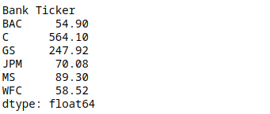

# Finance_Project
Data Analysis of stock prices([Raw Code](https://github.com/HarshitMaini3733/Finance_Project/blob/main/03-Finance%20Project.ipynb))

In this data project we will focus on exploratory data analysis of stock prices. It is not meant to be a robust financial analysis or be taken as financial advice.

## Data

We will get stock information for the following banks:

<ul>

<li>Bank of America</li>
<li>CitiGroup</li>
<li>Goldman Sachs</li>
<li>JPMorgan Chase</li>
<li>Morgan Stanley</li>
<li>Wells Fargo</li>

</ul>

#### Head of the data :

#### What is the max Close price for each bank's stock throughout the time period?

#### Creating a new empty DataFrame. This dataframe will contain the returns for each bank's stock.

#### Creating a pairplot of the returns dataframe : 

The Citygroup's stock stands out since it can be clearly seen in the visualization that its increase is minimal. More information from [Citygroup's stock crash.](https://en.wikipedia.org/wiki/Citigroup#November_2008.2C_Collapse_.26_US_Government_Intervention_.28part_of_the_Global_Financial_Crisis.29)

####Using this returns DataFrame, figure out on what dates each bank stock had the best and worst single day returns.

##### Worst Single Day return :

You should notice that 4 of the banks share the same day for the worst drop because Barack Obama is inaugurated as the 44th and first African-American President of the United States([United States Inauguration Day 2009](https://en.wikipedia.org/wiki/Portal:Current_events/2009_January_20))

##### Best Single Day return : 

You should have noticed that Citigroup's largest drop and biggest gain were very close to one another because [Citygroup had a stock split](https://www.citigroup.com/citi/news/2011/110321a.htm)

#### Take a look at the standard deviation of the returns : 

The riskiest over the period will be Citygroup bank becasue of the largest Standard Deviation.

#### Finding out the riskiest in th year 2015 : 

The profiles are very similar but can say that Morgan Stanley is the riskiest.

#### Creating a distplot of the 2015 returns for Morgan Stanley : 

#### Creating a distplot of the 2008 returns for CitiGroup :

#### Creating a line plot showing Close price for each bank for the entire index of time : 

#### Interactive line plot showing Close price for each bank for the entire index of time : 

#### Plotting the rolling 30 day average against the Close Price for Bank Of America's stock for the year 2008 : 

 #### Creating a heatmap of the correlation between the stocks Close Price : 
 
 
 
 ##### Creating a clustermap to cluster the correlations together : 
 
 
 
 #### Interactive heatmap of the correlation between the stocks Close Price : 
 
 
 
 #### Creating a candle plot of Bank of America's stock from Jan 1st 2015 to Jan 1st 2016 : 
 
 
 
 #### Creating a Simple Moving Averages plot of Morgan Stanley for the year 2015 : 
 
 
 
 #### Creating a Bollinger Band Plot for Bank of America for the year 2015 : 
 
 
